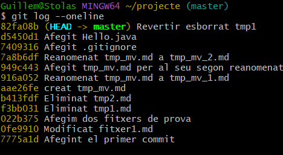

# Activitat - Documentació de passos Github

## Introducció
En aquesta activitat, seguirem els passos proporcionats per completar la tasca i documentar tot el procés en format Markdown. Es tracta d'un conjunt d'instruccions per utilitzar Git i altres feines relacionades.

## Pas 1: Iniciar el repositori
1. **Acció**: Crear un repositori nou a GitHub.
2. **Com fer-ho**:
   - Accedeix a GitHub.
   - Fes clic a "New Repository" i completa les dades.
3. **Resultat Esperat**: El repositori hauria de haverse creat correctament.

## Pas 2: Clonar el repositori localment
1. **Acció**: Clonar el repositori que acabem de crear al nostre ordinador.
2. **Com fer-ho**:
   - Obre la terminal.
   - Executa el comando:
     ```bash
     git clone https://github.com/usuari/repositori.git
     ```
3. **Resultat Esperat**: El repositori hauria de ser clònicament baixat al teu directori local.

## Pas 3: Realitzar canvis al repositori
1. **Acció**: Afegir un fitxer nou o editar un fitxer existent.
2. **Com fer-ho**:
   - Afegeix un nou fitxer o edita un existent.
   - Guarda els canvis.
3. **Resultat Esperat**: Els canvis s'han de realitzar correctament al repositori local.

## Pas 4: Commit i Push dels canvis
1. **Acció**: Realitzar un commit dels canvis i pujar-los al repositori remot.
2. **Com fer-ho**:
   - Executa les següents comandes:
     ```bash
     git add .
     git commit -m "Missatge del commit"
     git push origin main
     ```
3. **Resultat Esperat**: Els canvis s'han de reflectir al repositori remot a GitHub.

## Conclusió
En aquesta activitat, hem seguit els passos per utilitzar Git i GitHub per gestionar el nostre codi. Hem creat un repositori, clonarlo, realitzat canvis i pujat els canvis de manera efectiva.

## Resultat de Git log i Git log --oneline

commit 82fa08ba264332910945faced82311bed0eeeibd (HEAD -> muster) guillemruano06@gmail.com>

Author: Alumne DAM <guillemruano06@gmail.com> Date: Tue Oct 29 09:39:53 2024 +0100

Revertir esborrat tapi

commit d5450d13cdf203fb7a4f9babfbe6f4f602365e0b

Author: Alumne DAM <guillemruano06@gmail.com> Date: Tue Oct 29 09:37:34 2024 +0100

Afegit Hello.java

commit 7409316692d26ae93bc1c4bedccf84b7ecc9a660 Author: Alumme DAN <guillemruano06@gmail.com>

Date: Tue Oct 29 09:20:34 2024 +0100

Afegit .gitignore

commit 7a8b6df83430bc60b4b1d060ad4b9fae4075657a Alumne DABM <guillemruano06@gmail.com>

Author: Date: Tue Oct 29 09:17:40 2024 +0100

Reanomenat tmp_mv.md a tmp_mv_2.md

....skipping...

commit 82fa08ba264332910945faced82311bed0eee1bd (HEAD -> master) Author: Alumne DAM <guillemruano06@gmail.com>

Date: Tue Oct 29 09:39:53 2024 +0100

Revertir esborrat tmpl

commit d5450d13cdf203fb7a4f9babfbe6f4f602365e0b Author: Alumne DAM <guillemruano06@gmail.com>

Date: Tue Oct 29 09:37:34 2024 +0100

Afegit Hello.java

commit 7409316692d26ae93bc1c4bedccf84b7ecc9a660

Author: Alumne DAM <guillemruano06@gmail.com> Date: Tue Oct 29 09:20:34 2024 +0100

Afegit .gitignore

commit 7a8b6df83430bc60b4b1d060ad4b9fae4075657a

Author: Alumne DAM <quillemruano06@gmail.com> Date: Tue Oct 29 09:17:40 2024 +0100

Reanomenat tmp_mv.md a tmp_mv_2.md

commit 949c443a5dae7f18ca5e5ead38c5659f7c14e301

Author: Alumne DAM <quillemruano06@gmail.com> Tue Oct 29 09:17:15 2024 +0100 Date:

Afegit top ev.nd per al seu segon reanomenat

commit 916a0521480702580ef3bdafbb31775797ched41

Author: Alumne DAM <quillenruano06@gmail.com>

Date: Tue Oct 29 09:16:47 2024 +0100

Reanomenat tmp_mv.md a tmp_mv_1.md

commit aae26fefaa6fce8a905e6a707404201f682320d5

Author: Alumne DAM <guillemruano06@gmail.com> Date: Tue Oct 29 09:15:42 2024 +0100

creat tmp_mv.md

commit b413fdfaffe6d617d2fec32243a935b985fc5404

Author: Alumne DAM <guillemruano06@gmail.com>

Date: Tue Oct 29 09:15:11 2024 +0100

Eliminat tmp2.md

commit f3bb03155af2c417095b1edadc527454d27810ca : Alumne DAM <guillemruano06@gmail.com>

Author Date: Tue Oct 29 09:14:38 2024 +0100

Eliminat tmp1.md

commit 022b3754579066726f7bae5cd7a713da9da2410c

Author: Alumne DAM <guillemruano06@gmail.com>

Date: Tue Oct 29 09:13:20 2024 +0100

Afegim dos fitxers de prova

commit Ofe991085e47bf016246bd4b64d5a0ba447072ce Author: Alumne DAM <guillemruano06@gmail.com>

Date: Tue Oct 29 09:10:32 2024 +0100

Modificat fitxer1.md

commit 7775a1dbe80300a1541576fcba284ce754849617 Author: Alumne DAM <guillemruano06@gmail.com>

Date: Tue Oct 29 09:08:16 2024 +0100

Afegint el primer commit

