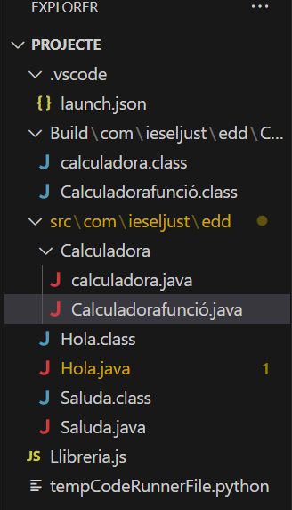

# Codi en Java: calculadora.java i Calculadorafunció.java

## calculadora.java:
```java
package com.ieseljust.edd.Calculadora;

import java.util.Scanner;

public class calculadora {
    public static void main(String[] args) {
        Scanner scanner = new Scanner(System.in);
        Calculadorafunció Calculadora = new Calculadorafunció();

        System.out.println("Calculadora simple para operaciones con números enteros");
        System.out.print("Ingrese el primer número: ");
        int num1 = scanner.nextInt();

        System.out.print("Ingrese el segundo número: ");
        int num2 = scanner.nextInt();

        System.out.println("Seleccione la operación: 1. Suma  2. Resta  3. Multiplicación  4. División");
        int choice = scanner.nextInt();

        try {
            int result = 0;
            switch (choice) {
                case 1:
                    result = Calculadora.Suma(num1, num2);
                    System.out.println("El resultado de la suma es: " + result);
                    break;
                case 2:
                    result = Calculadora.Resta(num1, num2);
                    System.out.println("El resultado de la resta es: " + result);
                    break;
                case 3:
                    result = Calculadora.Multiplica(num1, num2);
                    System.out.println("El resultado de la multiplicación es: " + result);
                    break;
                case 4:
                    result = Calculadora.Divide(num1, num2);
                    System.out.println("El resultado de la división es: " + result);
                    break;
                default:
                    System.out.println("Opción no válida");
                    break;
            }
        } catch (ArithmeticException e) {
            System.out.println("Error: " + e.getMessage());
        }

        scanner.close();
    }
}
```

## Calculadorafunció.java:
```java
package com.ieseljust.edd.Calculadora;

public class Calculadorafunció {

    public int Suma(int a, int b) {
        return a + b;
    }

    public int Resta(int a, int b) {
        return a - b;
    }

    public int Multiplica(int a, int b) {
        return a * b;
    }

    public int Divide(int a, int b) {
        if (b == 0) {
            throw new ArithmeticException("División por cero no permitida");
        }
        return a / b;
    }
}
```

## Explicació breu:

1. **calculadora.java** és el programa principal que es comunica amb l'usuari per realitzar les operacions. Primer, sol·licita dos números a l'usuari i després permet seleccionar una operació (suma, resta, multiplicació, divisió).
   
2. En funció de l'operació escollida, crida els mètodes corresponents de la classe **Calculadorafunció.java** per realitzar el càlcul.

3. La classe **Calculadorafunció.java** conté els mètodes per realitzar les operacions aritmètiques bàsiques: **Suma()**, **Resta()**, **Multiplica()** i **Divide()**. A més, inclou un control d'errors per evitar la divisió per zero (llançant una excepció **ArithmeticException** si es produeix aquest cas).

4. En cas que l'usuari intenti dividir per zero, es captura l'error i es mostra un missatge d'error específic. A la resta de les operacions, si s'introdueixen valors vàlids, els resultats es mostren a la consola.

## Ordre per a compilar
 javac -d Build -cp Build src\com\ieseljust\edd\Calculadora\calculadora.java src\com\ieseljust\edd\Calculadora\Calculadorafunció.java

## Ordre per a executar
java src\com\ieseljust\edd\Calculadora\calculadora.java

## Esctructura

