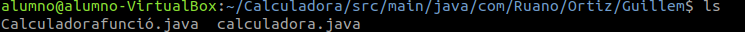
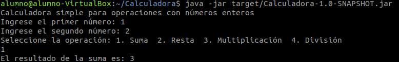

# Creació d'un Projecte Maven Interactiu i Configuració d'una Calculadora

## Pas 1: Creació del projecte Maven des de la línia d'ordres

Per a iniciar la creació d'un projecte Maven en mode interactiu, executem el següent comandament a la línia d'ordres:

```bash
mvn archetype:generate
```

Durant el procés, Maven ofereix una llista de plantilles disponibles. Per a simplificar, escollim la plantilla **maven-archetype-quickstart**. Maven ens demana que triem el número corresponent:

```plaintext
Choose a number or apply filter (format: [groupId:]artifactId, case sensitive contains): 2204
```

A continuació, seleccionem la versió del projecte. Triem la versió `1.0`:

```plaintext
Choose org.apache.maven.archetypes:maven-archetype-quickstart version:
1: 1.0-alpha-1
2: 1.0-alpha-2
3: 1.0-alpha-3
4: 1.0-alpha-4
5: 1.0
6: 1.1
7: 1.3
8: 1.4
9: 1.5
Choose a number: 5
```

Finalment, Maven demana altres propietats del projecte, com el `groupId`, l'`artifactId` i el `package`. Utilitzem la següent configuració:

```plaintext
Define value for property 'groupId': com.Ruano.Ortiz.Guillem
Define value for property 'artifactId': Calculadora
Define value for property 'version': 1.0-SNAPSHOT
Define value for property 'package': com.Ruano.Ortiz.Guillem
```

Un cop confirmats els valors, Maven crea el projecte amb èxit.

---

## Pas 2: Modificació del fitxer `pom.xml`

Editem el fitxer `pom.xml` generat per a incloure configuracions addicionals. Afegim el bloc `properties` per especificar la versió del compilador i el bloc `build` per configurar l'empaquetat del projecte:

```xml
<properties>
  <project.build.sourceEncoding>UTF-8</project.build.sourceEncoding>
  <maven.compiler.release>17</maven.compiler.release>
</properties>

<build>
  <pluginManagement>
    <plugins>
      <plugin>
        <artifactId>maven-jar-plugin</artifactId>
        <version>3.4.2</version>
        <configuration>
          <archive>
            <manifest>
              <addClasspath>true</addClasspath>
              <mainClass>com.Ruano.Ortiz.Guillem.Calculadora</mainClass>
            </manifest>
          </archive>
        </configuration>
      </plugin>
    </plugins>
  </pluginManagement>
</build>
```

---

## Pas 3: Implementació del codi de la calculadora

Al directori `src/main/java/com/Ruano/Ortiz/Guillem`, editem o afegim un fitxer Java anomenat `Calculadora.java` amb el següent fitxer:

## Pas 4: Compilació i empaquetat del projecte

Per compilar i empaquetar el projecte, executem:

```bash
mvn clean package
```

Aquest procés genera un fitxer JAR al directori `target`. El fitxer es pot executar amb:

```bash
java -jar target/Calculadora-1.0-SNAPSHOT.jar
```

