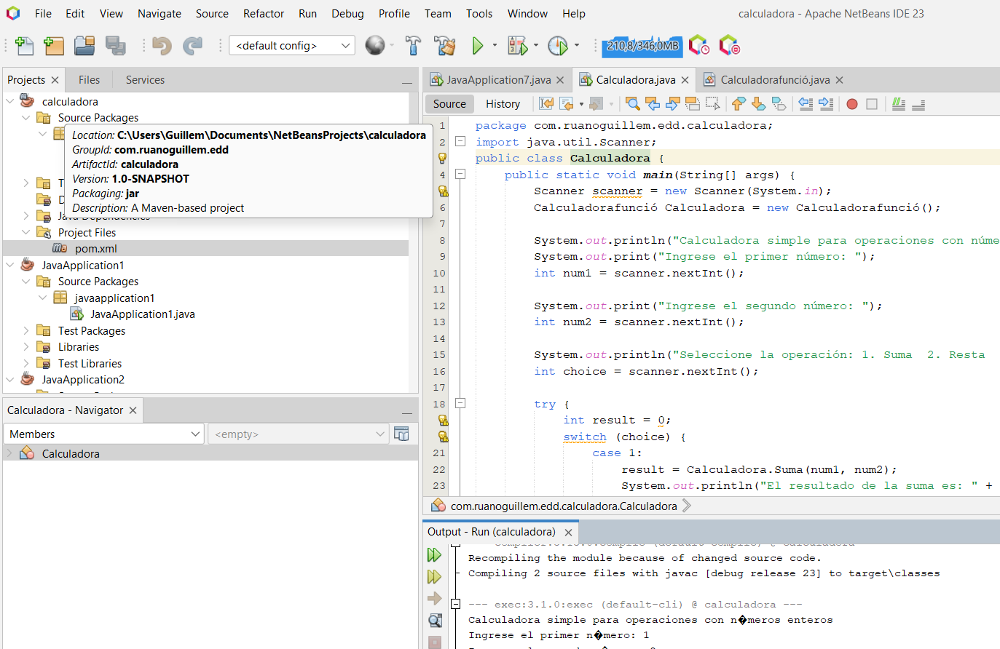

Creació d'un projecte Maven amb NetBeans

## Pas 1: Obrir NetBeans
1. Inicia NetBeans des de la icona corresponent al teu sistema operatiu.

## Pas 2: Crear un nou projecte Maven
1. A la barra superior, selecciona **File > New Project**.
2. A la finestra que apareix, selecciona les opcions següents:
   - **Categories:** Maven
   - **Projects:** Java Application
3. Fes clic a **Next**.

## Pas 3: Configurar les opcions bàsiques del projecte
1. A la pantalla següent, introdueix les dades següents:
   - **Project Name:** El nom del projecte (per exemple, `calculadora`).
   - **Project Location:** La carpeta on es guardarà el projecte.
   - **Group ID:** Un identificador únic que segueix el format d'un domini invertit (per exemple, `com.ruanoguillem.edd`).
   - **Artifact ID:** El nom del paquet principal (per exemple, `calculadora`).
   - **Version:** Generalment `1.0-SNAPSHOT` per a versions en desenvolupament.

2. Fes clic a **Finish**.

## Pas 4: Estructura del projecte
Un volta creat, NetBeans generarà l'estructura de fitxers següent:

```
calculadora/
|-- src/
|   |-- main/
|   |   |-- java/
|   |   |   |-- App.java (classe principal)
|   |-- test/
|       |-- java/
|           |-- AppTest.java (classe de proves)
|-- pom.xml
```

- **`src/main/java`**: Conté el codi font principal.
- **`src/test/java`**: Conté les proves unitàries.
- **`pom.xml`**: Fitxer de configuració Maven.

## Pas 5: Configurar el `pom.xml`
El fitxer `pom.xml` defineix les dependències i configuracions del projecte. Per defecte, tindrà aquest contingut bàsic:

```xml
<project xmlns="http://maven.apache.org/POM/4.0.0" xmlns:xsi="http://www.w3.org/2001/XMLSchema-instance"
    xsi:schemaLocation="http://maven.apache.org/POM/4.0.0 http://maven.apache.org/xsd/maven-4.0.0.xsd">
    <modelVersion>4.0.0</modelVersion>
    <groupId>com.ruanoguillem.edd</groupId>
    <artifactId>calculadora</artifactId>
    <version>1.0-SNAPSHOT</version>
</project>
```

Si necessites afegir dependències, pots fer-ho dins de l'etiqueta `<dependencies>`.

## Pas 6: Executar el projecte
1. Fes clic dret al nom del projecte a la vista de projectes.
2. Selecciona **Run** per compilar i executar el projecte.

Si tot està configurat correctament, veuràs el missatge de sortida definit a la classe principal `App.java`.



## Pas 7: Proves amb Maven
Per executar les proves, segueix aquests passos:
1. Fes clic dret al projecte.
2. Selecciona **Test**.

Maven executarà totes les proves definides al directori `src/test/java`.
