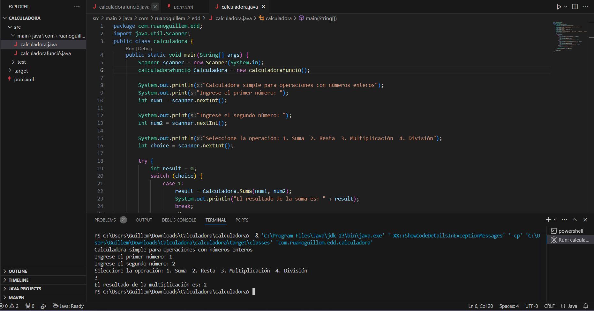

# Creació d'un Projecte Maven amb VSCode

## Introducció

Visual Studio Code (VSCode) ofereix una integració pràctica per treballar amb projectes Maven, permetent-nos crear projectes a partir d'arquetips i gestionar-los des de l'entorn gràfic.

---

## Pas 1: Preparació

1. Obri **Visual Studio Code** i accedeix a una finestra nova:  
   **Arxiu > Nova Finestra**.

2. Assegura't que tens instal·lat el **plugin de Maven** a VSCode. Si no el tens, instal·la'l des del **Marketplace**.

---

## Pas 2: Creació del projecte Maven

1. A la barra lateral, localitza la pestanya **MAVEN** en l'activitat de l'Explorador.

2. Fes clic en el símbol **"+"** situat a la dreta de la pestanya MAVEN.

3. En la **paleta d'ordes**, selecciona l'arquetip **maven-archetype-quickstart**.

4. Defineix les propietats següents:
   - **Versió**: `1.0`
   - **GroupId**: `com.ruanoguillem.edd`
   - **ArtifactId**: `Calculadora`

5. VSCode obrirà automàticament la **terminal integrada**, on hauràs de confirmar o definir la propietat `version`. Deixa el valor predeterminat `1.0-SNAPSHOT` i prem **Intro**.

6. Finalitzat aquest procés, VSCode generarà l'estructura de carpetes i el fitxer `pom.xml` del projecte.

---

## Pas 3: Revisió de l'Estructura del Projecte

Un cop creat el projecte, revisa l'estructura generada. La carpeta tindrà els següents elements:

- `src/main/java`: Conté el fitxer base del projecte (p. ex., App.java).
- `src/test/java`: Conté els fitxers de proves.
- `pom.xml`: Fitxer de configuració del projecte.

---

## Pas 4: Accions addicionals a VSCode

### Mostrar el POM Efectiu

1. A la pestanya **MAVEN**, fes clic dret sobre el projecte (Calculadora).
2. Selecciona **Show Effective POM**.
3. Es mostrarà un fitxer XML amb la combinació del **Super POM** i les propietats personalitzades.

### Actualització de la Caché d'Arquetips

1. Obre la **paleta d'ordes** amb `Ctrl + Shift + P`.
2. Escriu **Maven: Update Maven Archetype Catalog**.
3. Executa aquesta ordre per actualitzar els arquetips disponibles des del repositori central de Maven.

## Captura de la calculadora funcionant en vscode amb maven
